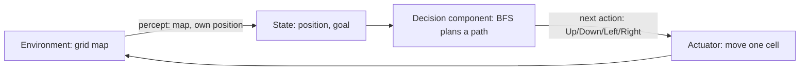

# Agents lab - goal-based warehouse agent

Run: `python3 agent.py`   Tests: `python3 -m pytest -q`

## Task 1 - understanding the problem
1. **Environment:** a 7x21 grid of cells; `#` blocked, `.` free, one `S` and one `G`. Fully observable, deterministic, static, single agent.
2. **Goal:** reach `G` from `S` without entering an obstacle.
3. **Actions:** Up, Down, Left, Right, one cell each.
4. **State the agent needs:** its current position (the map and goal are fixed knowledge).
5. **Goal-based, not simple reflex:** a reflex agent maps the current percept straight to an action (e.g. "if free on the right, go right") and can loop or get stuck in a dead end. This agent has an explicit goal and searches through sequences of moves to find one that reaches it before it acts.

**Think about it (twice as large):** BFS would still be correct and still return a shortest path, but it expands cells in every direction, so work and memory grow with the area (about 4x for double the width and height). Other difficulties: memory for the frontier, and many equal-cost paths. An informed search (A* with Manhattan distance) would be the natural upgrade.

## Task 2 - design

| Component | In the code |
|---|---|
| Environment | `WAREHOUSE` string -> `parse()` grid |
| Current state | `(row, col)` tuple |
| Goal | position of `G` |
| Actions | `MOVES` dict, filtered by `neighbours()` |
| Decision-making | `find_path()` (BFS) |

## Task 3 - prompt engineering
**Prompt used (summary):** Claude was asked to solve all four lab handouts and push them as a repo, with short code comments. The handout's suggested prompt (grid as 2-D array, collision-free path, print path or a no-path message, explain the algorithm) is covered by the program below.

1. **Did the LLM generate a working program on the first attempt?** Yes. It ran and produced a valid path first time, and the four tests passed first time.
2. **How could the prompt be improved?** Not needed here, but a better prompt would also ask for tests (blocked goal, adjacent goal) and say explicitly "shortest path", since that decides between BFS and DFS.
3. **Algorithm chosen:** breadth-first search.
4. **Why:** all moves cost 1 and the map is small, so BFS is simple and guarantees a shortest path. DFS can return a long winding path, and A*/Dijkstra add machinery that buys nothing with uniform cost on a small grid.

## Result
```
Moves: Right x3, Down, Right x3, Up, Right x12      Length: 20
#####################
#S***.#************G#
#.##****##########..#
#....##.............#
#.######.###.#.###..#
#........#..........#
#####################
```
Tests (all pass): path exists on the main map, path never enters `#`, adjacent goal gives 1 move, blocked goal returns no path.
